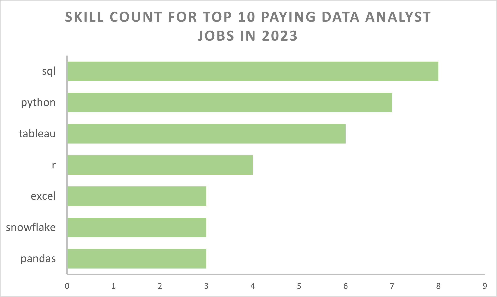
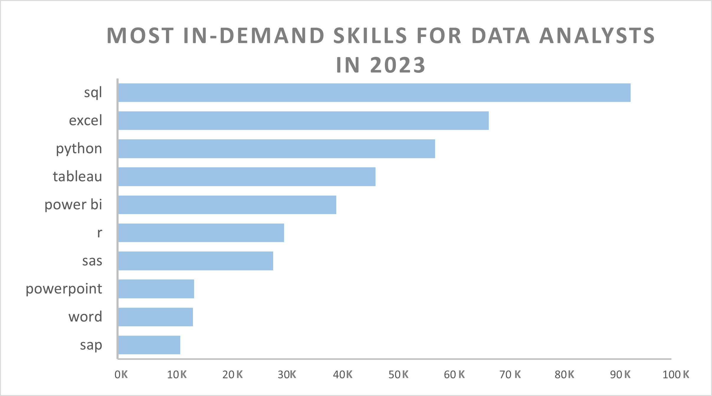
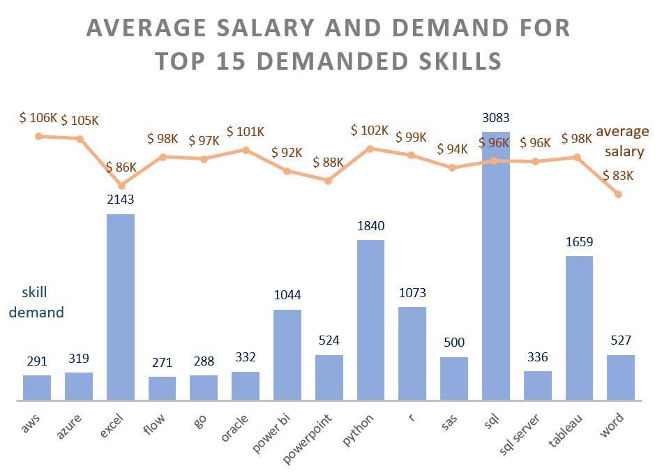
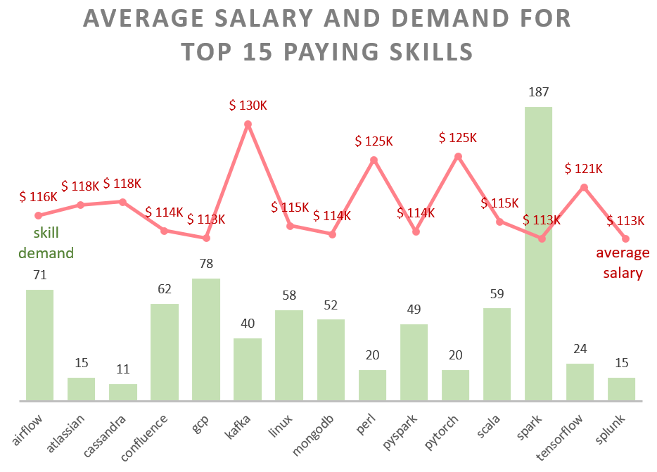

# 2023 US Data Analyst Job Market and Skills Analysis 
This project examines top-paying jobs, in-demand skills, and the intersection of high demand and high salaries in the data analyst job market.
# Project Description
Motivated by the need to better understand the data analyst job market, this project aims to identify top-paid and in-demand skills, making it easier for job seekers to prepare for optimal job opportunities.

Explore the SQL queries used in this analysis [here](project_queries).

The data comes from Luke Barousse's  [SQL Course](http://lukebarousse.com/sql), offering insights into job titles, salaries, locations, and essential skills.

# Summary of Analysis
### Q1. What are the top-paying data analyst jobs?
| Job Title                                      | Company Name                                 | Average Annual Salary ($) |
|------------------------------------------------|----------------------------------------------|---------------------------|
| Data Analyst                                   | Mantys                                       | 650,000                   |
| Director of Analytics                          | Meta                                         | 336,500                   |
| Associate Director- Data Insights              | AT&T                                         | 255,829                   |
| Data Analyst, Marketing                        | Pinterest Job Advertisements                 | 232,423                   |
| Data Analyst (Hybrid/Remote)                   | Uclahealthcareers                            | 217,000                   |
| Principal Data Analyst (Remote)                | SmartAsset                                   | 205,000                   |
| Director, Data Analyst- HYBRID                 | Inclusively                                  | 189,309                   |
| Principal Data Analyst, AV Performance Analysis| Motional                                     | 189,000                   |
| Principal Data Analyst                         | SmartAsset                                   | 186,000                   |
| ERM Data Analyst                               | Get It Recruit - Information Technology      | 184,000                   |

The top 10 highest-paying data analyst roles show a wide salary range, from $650,000 to $184,000, and span diverse industries, including healthcare and technology. The varied job titles reflect different levels of responsibility and seniority.
### Q2. What skills are required for these top-paying jobs?

SQL is the most demanded skill, appearing in 8 out of the top 10 highest-paying data analyst jobs, making it essential for data analysts. Following SQL, Python and Tableau are also highly sought after, appearing 7 and 6 times respectively.
### Q3. What skills are most in demand for data analysts?

The most in-demand skills are SQL and Excel, highlighting the importance of fundamental skills in data processing and spreadsheet manipulation. Following these are Python, Tableau, and Power BI, indicating a growing demand for proficiency in programming languages and visualization tools. This demonstrates that technical skills, along with the ability to communicate and tell stories with data, are crucial in today's job market.
### Q4. Which skills are associated with high salaries?
| Skills    | Average Salary ($) |
|-----------|--------------------|
| svn       | 400,000            |
| solidity  | 179,000            |
| couchbase | 160,515            |
| datarobot | 155,486            |
| golang    | 155,000            |
| mxnet     | 149,000            |
| dplyr     | 147,633            |
| vmware    | 147,500            |
| terraform | 146,734            |
| twilio    | 138,500            |

"svn" commands the highest average salary at $400,000, more than double the other salaries, indicating a very high pay in a niche expertise.

Skills related to new and emerging technologies, such as "solidity" for blockchain, "mxnet" for deep learning, "datarobot", and "golang", are highly valued. Additionally, data management and manipulation tools like "couchbase" and "dplyr" reflect the importance of skill in the data management and analysis domains.

The consistent high salaries across diverse skills indicate a competitive market for specialized technical skills. Employers are willing to offer substantial compensation for proficiency in both established and emerging technologies.

### Q5. What are the most optimal skills to learn?

Among the most demanded skills, cloud tools and technologies like AWS and Azure offer the highest pay, at $106K and $105K respectively. Programming languages such as Python and R follow, with significantly higher demand (about five times that of cloud tools) and substantial salaries of $102K and $99K. 

The most demanded skill, SQL, has an average salary of $96K. Fundamental skills like Word and Excel, although highly demanded, have relatively lower salaries among the top 15 most in-demand skills

"Kafka" commands the highest salary at $129,999, followed by "Pytorch" ($125,226) and "Perl" ($124,686). "Spark" has the highest demand (187) but a lower average salary ($113,002), while "GCP" is also in high demand (78) with an average salary of $113,065.

Overall, the data suggests a mix of specialized and fundamental skills in emerging technologies, cloud computing, machine learning, and data processing are particularly well-compensated.

# Tools Used
- **PostgreSQL**: Database management system
- **Visual Studio Code**: Writing and executing SQL queries
- **Excel**: Creating charts and graphs
- **Git & GitHub**: Version control and project sharing

# Conclusion
1.**Top Paying Data Analyst Jobs**: The highest paying remote Data Analyst positions in 2023 exhibit a wide salary range across various industries, peaking at $650,000.

2.**Skills for Top-Paying Jobs**: Analysis indicates that high-paying data analyst roles require advanced proficiency in SQL, Python, and Tableau, underscoring their critical importance in securing top salaries.

3.**Most In-Demand Skills**: SQL, Excel, and Python are the most demanded skills. SQL and Python consistenly appear in top job/skill listings, marking their essential role for job seekers.

4.**Skills with High Salaries**: Specialized skills such as SVN and Solidity are associated with the highest average salaries, reflecting a premium on niche expertise. The data highlights the importance of acquiring specialized skills to command higher salaries in the job market. Professionals with expertise in niche or emerging technologies tend to earn more.

5.**Optimal Skills for Job Market Value**: For job seekers with limited experience, SQL is identified as the most valuable skill due to its high demand and competitive pay. Additionally, proficiency in visualization tools such as Tableau and Power BI is advantageous. 

For experienced professionals seeking to enhance their income, a combination of specialized and fundamental skills is recommended, with compensation varying based on the niche and prevalence of each skill.
